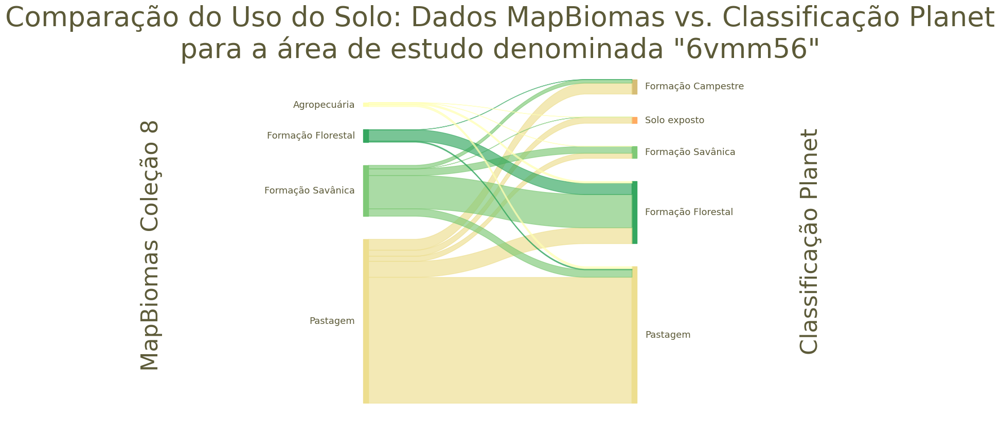
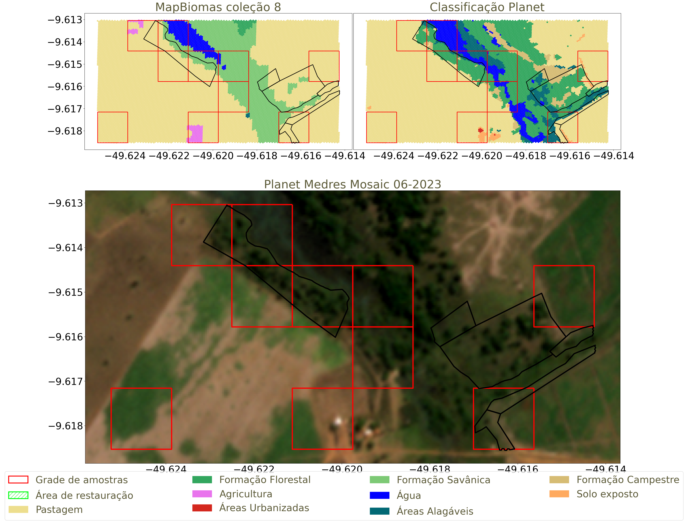
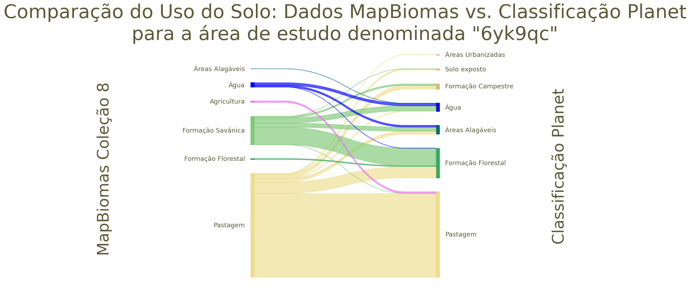
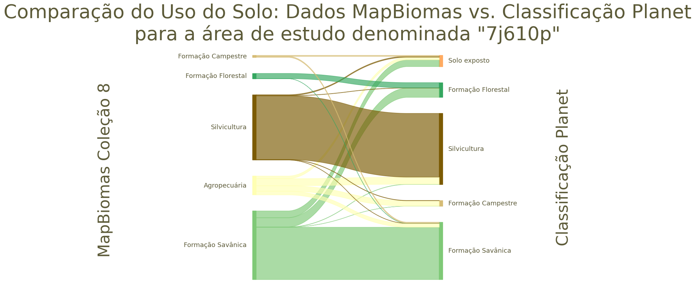
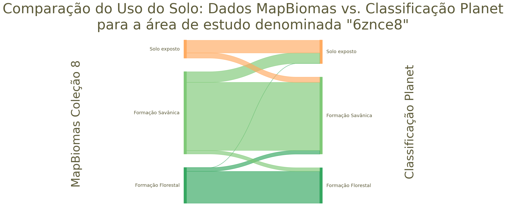
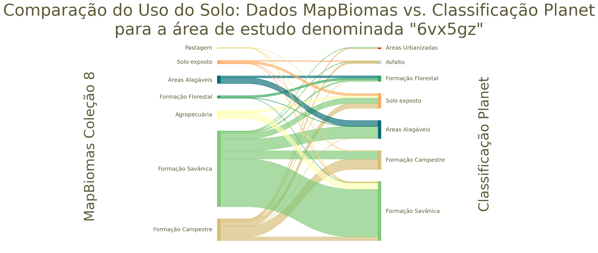
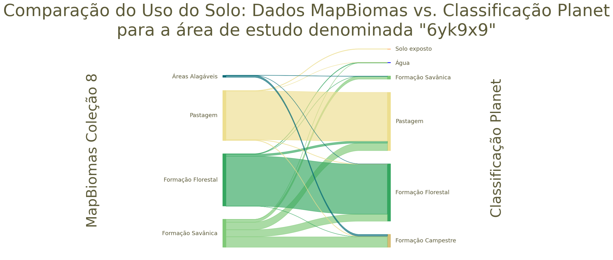
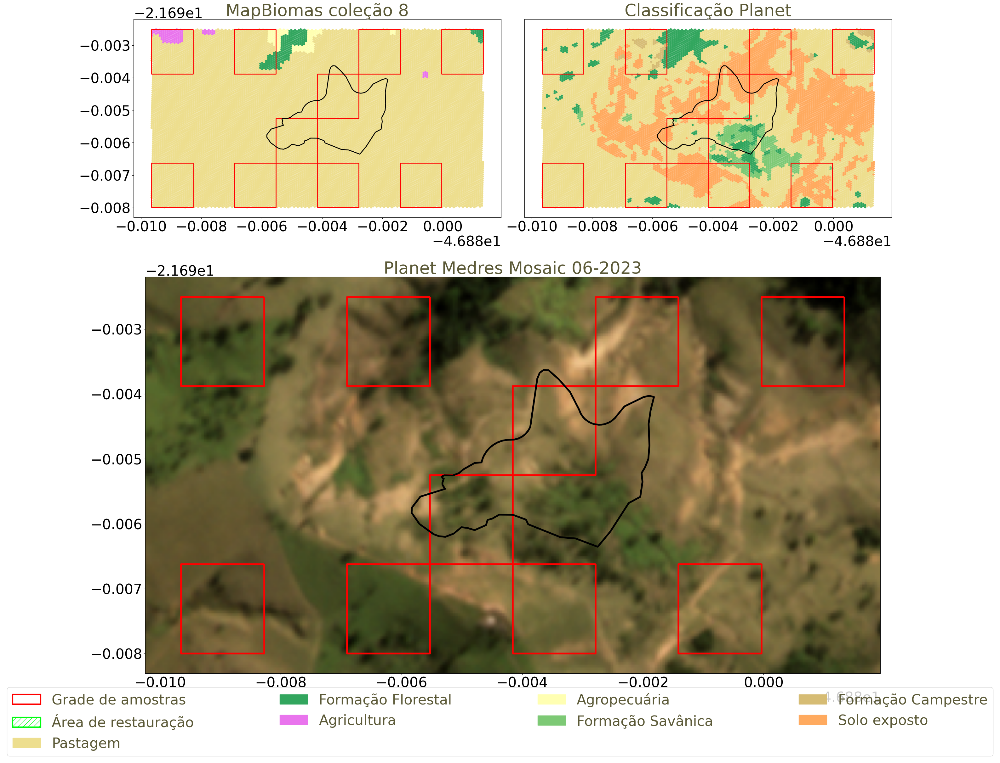
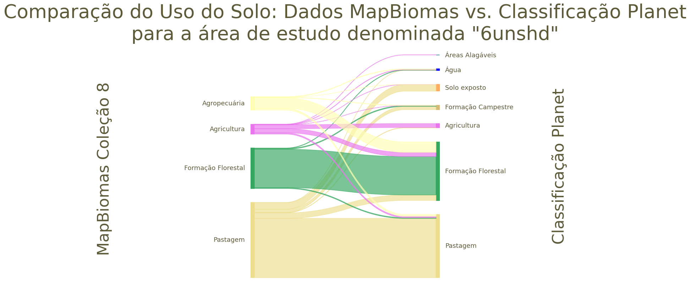

## [Resultado para GeoHash 7j6122](7j6122.md) 

  
  

## [Resultado para GeoHash 6yk7ym](6yk7ym.md) 

  
  

## [Resultado para GeoHash 6znc7w](6znc7w.md) 

  
  

## [Resultado para GeoHash 6vmm56](6vmm56.md) 

  
  

## [Resultado para GeoHash 6yk9qc](6yk9qc.md) 

  
  

## [Resultado para GeoHash 7j610p](7j610p.md) 

  
  

## [Resultado para GeoHash 6znce8](6znce8.md) 

  
  

## [Resultado para GeoHash 6vx5gz](6vx5gz.md) 

  
  

## [Resultado para GeoHash 6zncec](6zncec.md) 

  
  

## [Resultado para GeoHash 6yk9x9](6yk9x9.md) 

  
  

## [Resultado para GeoHash 6gvmzx](6gvmzx.md) 

  
  

## [Resultado para GeoHash 6unst4](6unst4.md) 

  
  

## [Resultado para GeoHash 6vqt8g](6vqt8g.md) 

  
  

## [Resultado para GeoHash 6gv7r0](6gv7r0.md) 

  
  

## [Resultado para GeoHash 6unshd](6unshd.md) 

  
  

