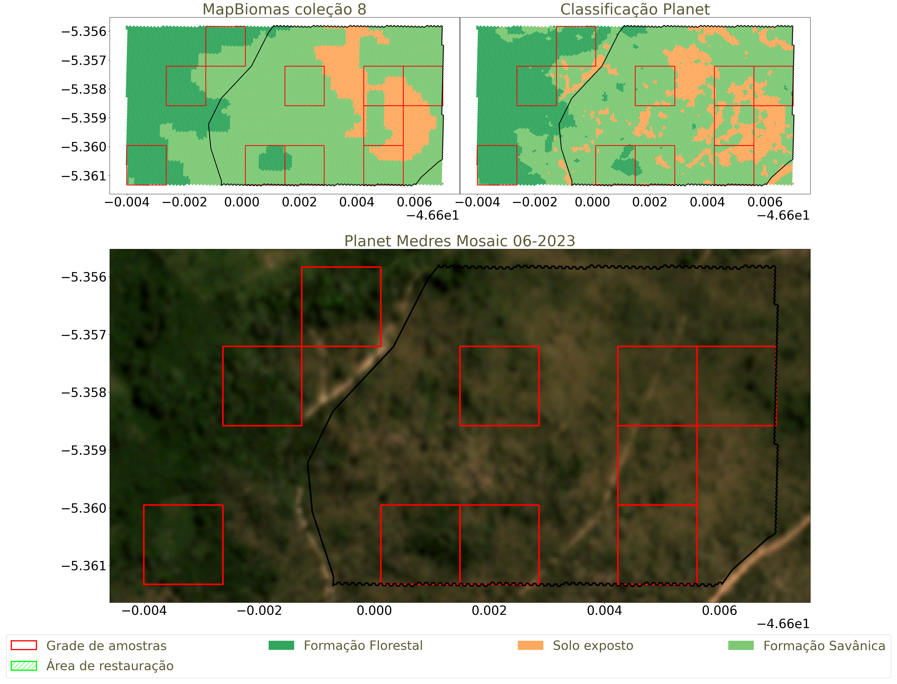
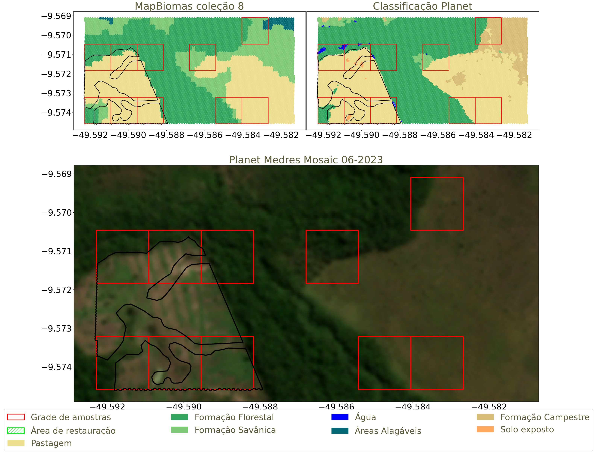
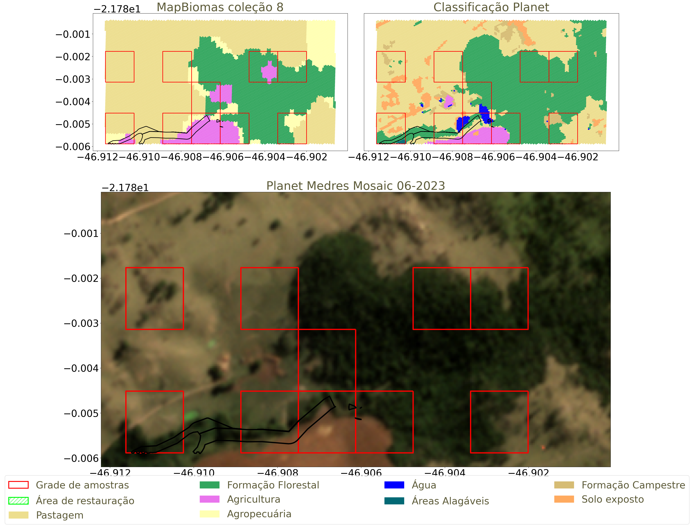

## [Resultado para GeoHash 7j6122](resultados/7j6122.md) 

  

## [Resultado para GeoHash 6yk7ym](resultados/6yk7ym.md) 

  

## [Resultado para GeoHash 6znc7w](resultados/6znc7w.md) 

  

## [Resultado para GeoHash 6vmm56](resultados/6vmm56.md) 

  

## [Resultado para GeoHash 6yk9qc](resultados/6yk9qc.md) 

  

## [Resultado para GeoHash 7j610p](resultados/7j610p.md) 

  

## [Resultado para GeoHash 6znce8](resultados/6znce8.md) 

  

## [Resultado para GeoHash 6vx5gz](resultados/6vx5gz.md) 

  

## [Resultado para GeoHash 6zncec](resultados/6zncec.md) 

  

## [Resultado para GeoHash 6yk9x9](resultados/6yk9x9.md) 

  

## [Resultado para GeoHash 6gvmzx](resultados/6gvmzx.md) 

  

## [Resultado para GeoHash 6unst4](resultados/6unst4.md) 

  

## [Resultado para GeoHash 6vqt8g](resultados/6vqt8g.md) 

  

## [Resultado para GeoHash 6gv7r0](resultados/6gv7r0.md) 

  

## [Resultado para GeoHash 6unshd](resultados/6unshd.md) 

  

